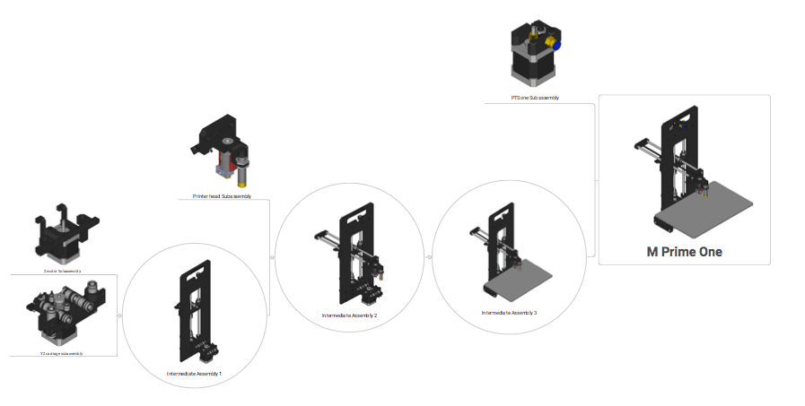

# M Prime One manuals

This repository contains the FreeCAD files used to make the M Prime One assembly manual. It is still a work in progress.

You have to install the Exploded Assembly FreeCAD module to see the assembly animations in FreeCAD (https://github.com/JMG1/ExplodedAssembly)

## License

The files of this 3D printer project have been released under the Creative Commons Attribution 4.0 license. This license lets you modify and share the sources for any purpose, even commercial, with the only requeriment of giving credit to the author.

Feel free to take a look at the files, modify them for your own uses, create new parts, etc. If you do so, I would be very happy if you let me know of your projects. Also, if possible, share them with the community with this or other free license.
